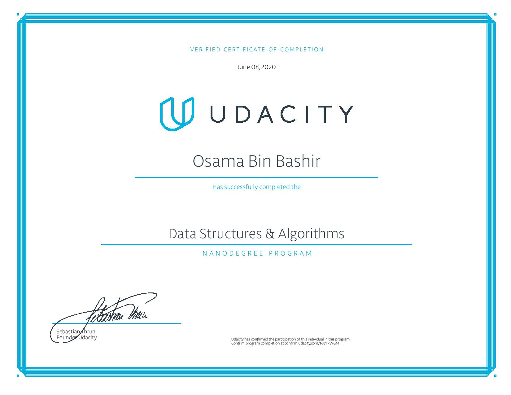

# NanoDegree DataStructures and Algorithms

This repository contains all the assingments that I did for compleing my degree. I am opensourcing it so that fellow collegues can get help from it. By copying the assignment from here and submitting wont get you anything and you will learn nothing. So use this Repo to compare your code or analysis or if you are stuck. I wish you all a very good luck :D

## Special Mention
I would like to thanks Udacity for providing me this opportuinity to by allowing this degree for free for a month.
